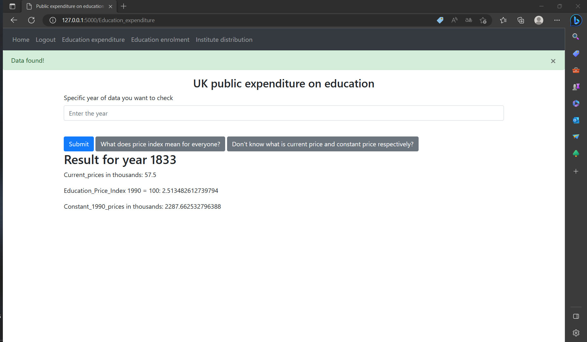

# COMP0034 Coursework 2
URL to repository: https://github.com/ucl-comp0035/comp0034-cw2-i-Shizuka-moto.git
Method of managing dependencies and environments: venv and pip with requirements.txt and setup.py
# Set-up instructions
All function packages were preinstalled.
1. Decompress and open the repository folder (in this case, "comp0034-cw1-i-Shizuka-moto") in your code editor.

2. To run the dash app, simply type "python main.py" in the terminal. Then open the link provide by terminal.

3. There would be a navigate bar on the top of page, single click on sign up to create an account

4. after that, you could access every function on navigate bar. After entering the note information, click add note fucntion for push the information to the database. There should be A flash (error handling) after that.

5. Take the education expenditure function as the example, enter the year between 1833 and 2019. Then there should be a flash for data found and data should be right below the button. The gray buttons are twon links for explaination if there is any confusion.

6. How to access database information? Install a database reader. I use "SQLite Viewer" in entension of Visual Studio Code

# Application code
1. How every folder work?
In the data folder, original data in xlsx format is stored, use "csv_to_sqlite.py" to import the data into database.
In static folder, there's a function file to delete the notes created by user according to userid, this link to database and would delete the information in database either.
In templates folder, the "base.html" file is the main template for all the other files in this folder. This include navigate bar function, bootstrap, decorate functions and so on. Those files are linked with the "auth.py" file and "views.py" file which those two files call these template through "render" function. Other html file use  code to inherit all the information in the basement file. Those templates file also include some python command to decide whether return data information(if specific year of data do exist).
2. How flask app run?
In a file called "main.py" outside the "flaskapp“ folder, this file call the "flaskapp" folder and initialise the flask app. And "__init__.py" file in "flaskapp" folder would run automatically.
In the "__init__.py" file, database and configuration information was definded. And also connect blueprints file and all other python file together. This file also define the location of database.
"auth.py" file define how every page work, which HTTP method used and also which template is used. Error handling function is also defined in this file. 
"config.py" file define the configuration of flask app, this is quiet important when we test the app.
"models.py" file define every table in database file, type of data is stored in this file. Every class has a primary key column for identification purpose. The class note and user connect with each other cause note has to insert with specific user. In other words, user could only insert note information to database if they have already login. So that notes has been connect with their user.
"schemas.py" file define schema classes according to classes we have in "models.py" file.
"views.py" file define home page information which include add note and delete note. This file call "index.js" file in static folder to identify specific information in database (according to userid).
# Testing code

In the test folder "confest.py" file run a flask app and a test client then return it to the "test_faskapp.py" file.
In "test_flaskapp.py" we define how we test every page in flask app. 

For test_home function, check the status code to check the service.
In test_whether_login_successfully function, check the title text and Whether the page is named "home". Also insert a testnote data for testing the note fucntion. Check whether a flash was on the page and also the website name and page title.
In test_registration function, using post command for entering infromation. And use assert to check whether there's a new user with that registion email.
In test_Education_expenditure_page function, after register and login command were done. Enter 1833 year to check whether the home page return the correct information. And check the flash (error ahndling) function and website title also. 
In test_Education_enrolment_page function, after register and login command were done. Enter 1854 year to check whether the home page return the correct information. And check the flash (error ahndling) function and website title also. 
In test_Institute_distribution_page function, after register and login command were done. Enter 1880 year to check whether the home page return the correct information. And check the flash (error ahndling) function and website title also. 
# Conclusion
The application has a user login for data security. If you add your citizenship number to the database you can add more information for verification during registration. All data queries are based on an existing login. The data query page has buttons for people who are not familiar with the background knowledge of the data to quickly access it. A feedback and suggestion board is set up and the data entered by the user is stored in the database. The user is prompted with a green (successful) or red (error) flash (error handling) when an action is successful. The registration screen alerts you if you have entered incorrect information.
Testing has tested most of the features. However, the hyperlink button was not tested. This is because it is only a hyperlink function and the likelihood of an error is very low. This makes testing much more efficient.
The requirements.txt file contains all the required libraries.
Method of managing dependencies and environments: venv and pip with requirements.txt and setup.py

Finally, thank you for giving us such an amazing study experience in COMP0034.